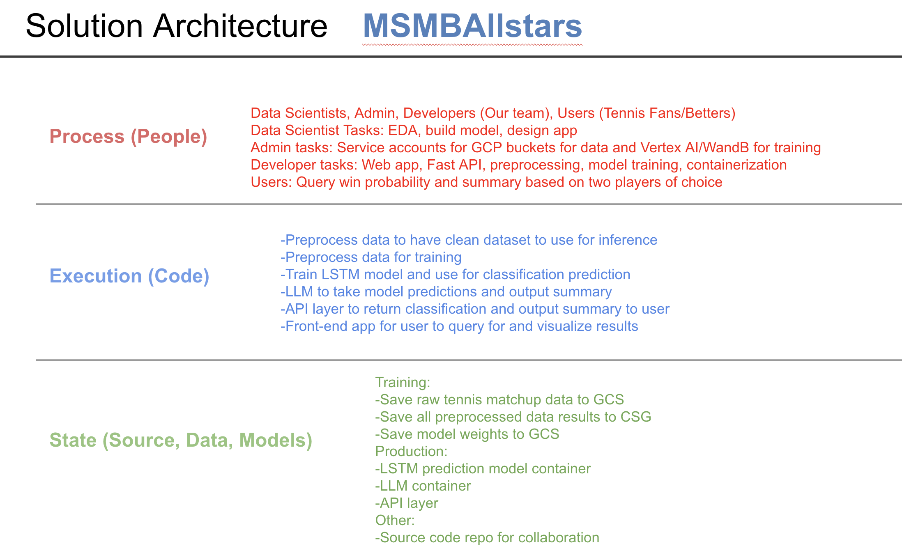
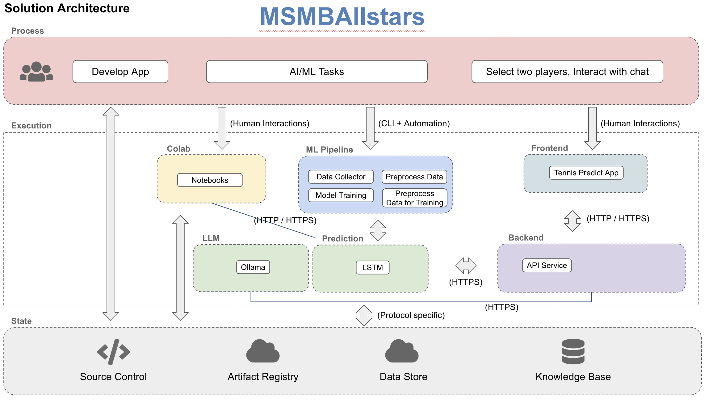
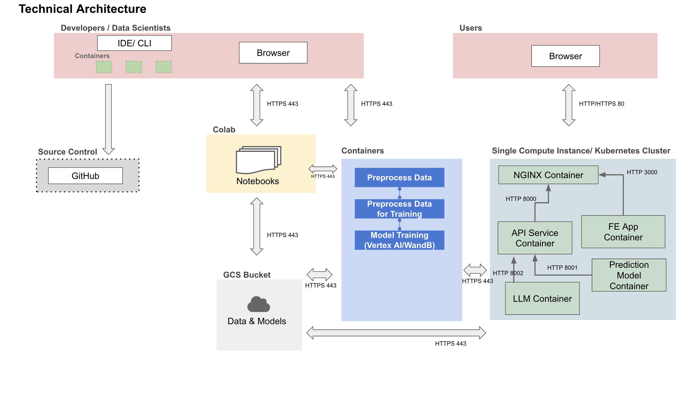

# AC215 - Milestone 4 (MSMBAllstars)

**Team Members**

- Itamar Belson
- Kenny Chen
- Sam Crowder
- Clay Coleman

**Group Name**

MSMBAllstars

**Project**

The goal of this project is to develop a machine learning application that accurately predicts the outcome of a tennis match given a handful of inputs about the matchup.
We plan to use a recurrent architecture (e.g. LSTM) trained on an autoregressive format of the underlying data, as in train on match i to j for player 1 and similarly for player 2, (using the same LSTM block across two players) join the two hidden state outputs at j, and predict probability of winning in match j+1 where player 1 and player 2 will play (where i <= j).

At a high level, we take a lookback period to determine the sequence length of our training data. For example, we have two players who will face off, and we'll take the previous `LOOKBACK` window of their matches (against any opponent) prior to their face off, as well as their head to head history, and calculate features at each time step (original values as well as percent differences vs opponent for that match). This counts as one training sample, consisting of player a, player b, and head to head data tensors.

At model training time, for each sample in a batch, player a and player b tensors are passed through the same LSTM block, then concatenated together along with head to head tensor, then pushed through some linear layers, and finally into a final sigmoid function to produce the probability that the player in the first position will win the match.

### Milestone 4

We'll primarily use a dataset available on GitHub of all ATP matches over the last several decades, presented in CSV format. This dataset can be viewed here: https://github.com/JeffSackmann/tennis_atp/tree/master.

There are 193337 records in total for ATP Men's Singles matches in this dataset.

## Project Organization

    ├── README.md
    ├── data
    │   └── [multiple csv data files]
    ├── deliverables
    │   ├── containers
    │   │   └── [screenshots and video captures of containers working]
    │   └── mock-ups
    │       └── [mock-ups of the UI]
    └── src
        ├── api [containerized service for central API server]
        │   ├── Dockerfile
        │   ├── Pipfile
        │   ├── app.py
        │   └── docker-shell.sh
        ├── llm [containerized service for LLM chat server]
        │   ├── Dockerfile
        │   ├── ollama.Dockerfile
        │   ├── Pipfile
        │   ├── app.py
        │   ├── docker-compose.yml
        │   └── docker-shell.sh
        ├── probability_model [containerized service for trained model server]
        │   ├── Dockerfile
        │   ├── Pipfile
        │   ├── app.py
        │   ├── docker-compose.yml
        │   └── docker-shell.sh
        ├── preprocessing [containerized pipeline for data preprocessing]
        │   ├── Dockerfile
        │   ├── Pipfile
        │   ├── docker-shell.sh
        │   └── preprocess.py
        ├── preprocessing_for_training_data [containerized pipeline for data preprocessing for training]
        │   ├── Dockerfile
        │   ├── Pipfile
        │   ├── docker-shell.sh
        │   ├── helper.py
        │   └── preprocess.py
        └── train_probability_model [containerized pipeline for training the model]
            ├── Dockerfile
            ├── Pipfile
            ├── cli.sh
            ├── docker-shell.sh
            ├── package-trainer.sh
            ├── train_model.py
            └── model.py

## System Architecture

 


Preprocess container
------------
- Required inputs: GCS Project Name and GCS Bucket Name.
- Output: Processed data stored in the GCS Bucket.

(1) `src/preprocessing/preprocess.py`: This file manages the preprocessing of our dataset.

(2) `src/preprocessing/Pipfile`: Lists the Python packages essential for image preprocessing.

(3) `src/preprocessing/Dockerfile`: The Dockerfile is configured to use `python:3.9-slim-buster`. It sets up volumes and uses secret keys (which should not be uploaded to GitHub) for connecting to the GCS Bucket.

### Running the preprocessing container
**Setup GCP Service Account**
1. Create a secrets folder that is on the same level as the project folder.
2. Head to [GCP Console](https://console.cloud.google.com/home/dashboard).
3. Search for "Service Accounts" from the top search box OR go to: "IAM & Admins" > "Service Accounts" and create a new service account called "MSMBAllstars".
4. For "Grant this service account access to project", and give the account the following three permissions:
      - "Cloud Storage" > "Storage Object Viewer"
      - "Cloud Storage" > "Storage Object User"
      - "Cloud Storage" > "Storage Object Creator"
5. Click done. This will create a service account.
6. Click on the "..." under the "Actions" column and select "Manage keys".
7. Click on "ADD KEY" > "Create new key" with "Key type" as JSON.
8. Copy this JSON file into the secrets folder created in step 1 and rename it as "data-service-account.json".

**Setup GCS Bucket**
1. Head to [GCP Console](https://console.cloud.google.com/home/dashboard).
2. Search for "Buckets" from the top search box OR go to: "Cloud Storage" > "Buckets" and create a new bucket with an appropriate bucket name e.g. "msmballstars-test".
3. Click done. This will create a new GCS Bucket.

**Add Raw Data to GCS Bucket**
1. In the new GCS Bucket, create a folder called "raw_data".
2. Upload all of the atp_matches_<year>.csv files from https://github.com/JeffSackmann/tennis_atp/tree/master into the "raw_data" folder.

**Set GCP Credentials**
1. Head to src/preprocessing/docker-shell.sh.
2. Replace `GCS_BUCKET_NAME` and `GCP_PROJECT` with corresponding GCS Bucket Name that you have chosen above and GCP Project Name.

**Execute Dockerfile**
1. Execute `docker-shell.sh` from its directory to build and run the docker container.
2. Upon completion, your GCS Bucket should display the processed data as shown under the default folder name "version1".

Preprocessing for Training Data container
------------

The processed data from the previous step joins all individual ATP results and removes entries with null values that are used as input data to our ML model. The output from the previous step also generates its file for the purpose of create an in-memory database for the API container below. Hence why there is a separation with this container, which takes the data from the previous preprocessing step and outputs data ready to feed into our LSTM.

**Execute Dockerfile**
1. Head to src/preprocessing_for_training_data.
2. Specify in `docker-shell.sh` the `DATA_FOLDER`, and `DATA_FILE` of preprocessed data from previous step. Also specify `LOOKBACK` which defines the sequence length of training data.
3. Execute `docker-shell.sh` from its directory to build and run the docker container. This will write the training data as a .pkl file to the same GCS folder where we read the data from.

Train Probability Model container
------------

We now take the data from the previous container and train our LSTM.

**Execute Dockerfile**
1. Head to src/train_probability_model.
2. Specify in `docker-shell.sh` the `DATA_FOLDER`, and `DATA_FILE` of preprocessed data for training from previous step. Also specify the numeric valus for training. Make sure you have WANDB_API_KEY set in the secrets folder.
3. Execute `docker-shell.sh` from its directory to build and run the docker container. This will write the model weights data as a .pt file to the same GCS folder where we read the data from. Alternatively to run on Vertex AI, first run `package-trainer.sh` and then `cli.sh`.

## Deploy Locally

To run the application locally using Docker Compose:

1. Navigate to the src directory:

```bash
cd src
```

2. Start all services:

```bash
docker compose up --build
```

This will start:

- API service on port 8000
- Probability Model service on port 8001
- LLM service on port 8002
- Ollama service (internal use only)

3. Call the services via curl:

```bash
# Test prediction endpoint
curl -X POST http://localhost:8000/predict \
  -H "Content-Type: application/json" \
  -d '{
    "player_a_id": "Roger Federer",
    "player_b_id": "Rafael Nadal",
    "lookback": 10
  }'

# Test chat endpoint
curl -X POST http://localhost:8000/chat \
  -H "Content-Type: application/json" \
  -d '{
    "query": "Who is more likely to win between Federer and Nadal?",
    "history": []
  }'
```

## Deploy to GCP

To deploy the application to Google Cloud Platform:

1. Ensure you have the necessary GCP credentials and permissions

2. Navigate to the src directory:

```bash
cd src
```

3. Run the deploy script:

```bash
./deploy.sh
```

This will:

- Build and push Docker images to Google Container Registry
- Deploy services to Cloud Run:
  - API service
  - Probability Model service
  - LLM service
- Configure service URLs and environment variables

The script will output the public URLs for each service when complete.

### Manual Deployment via GitHub Actions

To manually trigger a deployment:

1. Go to GitHub repository
2. Click "Actions"
3. Select "Deploy to Cloud Run"
4. Click "Run workflow"

The deployment status and logs can be monitored in the GitHub Actions tab.

## Testing / CICD

Our project uses GitHub Actions for comprehensive testing across all components. The testing infrastructure is split into several pipelines:

### GitHub Actions Pipelines

1. **Frontend Testing** (`frontend-unit-tests.yml`)
   - Triggers on all branch pushes
   - Runs React component unit tests
   - Enforces 50% minimum coverage for:
     - Statements
     - Branches
     - Functions
     - Lines
   - Uploads coverage reports as artifacts

2. **Backend Testing** (`backend-unit-tests.yml`)
   - Triggers on pushes affecting backend code
   - Tests the following services:
     - preprocessing
     - preprocessing_for_training_data
     - train_probability_model
     - probability_model
   - Enforces 50% minimum coverage

3. **API Testing** (`api-unit-tests.yml`)
   - Triggers on all branch pushes
   - Runs FastAPI endpoint tests
   - Enforces 50% minimum coverage

4. **Integration Testing** (`integration-test.yml`)
   - Triggers on all branch pushes
   - Spins up all services via Docker Compose
   - Tests API endpoints and inter-service communication
   - Verifies end-to-end functionality

5. **System Testing** (`system-test.yml`)
   - Triggers on all branch pushes
   - Runs full E2E tests using Playwright
   - Tests complete user flows through the frontend
   - Verifies integration with backend services

6. **Deployment Pipeline** (`deploy.yml`)
   - Triggers on:
     - Pushes to `main` branch
     - Manual workflow dispatch
   - Authenticates with GCP using Workload Identity Federation
   - Builds and pushes Docker images to Container Registry
   - Deploys services to Cloud Run:
     - API service
     - Probability Model service
     - LLM service
   - Configures service URLs and environment variables

### Running Tests Locally

1. **Frontend Tests**
   ```bash
   cd src/frontend/tennis-app
   
   # Install dependencies
   npm install
   npx playwright install --with-deps chromium
   
   # Run unit tests
   npm test
   
   # Run unit tests with coverage
   npm test -- --coverage
   
   # Run E2E tests
   npm run test:e2e
   ```

2. **Backend Service Tests**
   ```bash
   # Replace SERVICE_NAME with:
   # - preprocessing
   # - preprocessing_for_training_data
   # - train_probability_model
   # - probability_model
   
   cd src/SERVICE_NAME
   pipenv install --dev
   pipenv run pytest tests/ -v --cov=. --cov-report=term-missing --cov-fail-under=50
   ```

3. **API Tests**
   ```bash
   cd src/api
   pipenv install --dev
   pipenv run pytest tests/ -v --cov=. --cov-report=term-missing --cov-fail-under=50
   ```

4. **Integration Tests**
   ```bash
   cd src
   chmod +x integration_test.sh
   ./integration_test.sh
   ```

5. **System Tests**
   ```bash
   cd src
   chmod +x system_test.sh
   ./system_test.sh
   ```

### Test Files Location

- Frontend Tests: `src/frontend/tennis-app/src/**/*.test.tsx`
- Backend Tests: `src/*/tests/`
- E2E Tests: `src/frontend/tennis-app/e2e/`
- Integration Test Script: `src/integration_test.sh`
- System Test Script: `src/system_test.sh`

### Coverage Requirements

All components must maintain minimum 50% test coverage. Coverage reports are generated automatically:

- Frontend: Available in `src/frontend/tennis-app/coverage/`
- Backend: Generated during test runs with `--cov-report=term-missing`

Coverage checks are enforced in CI/CD pipelines and must pass for PRs to be merged.
